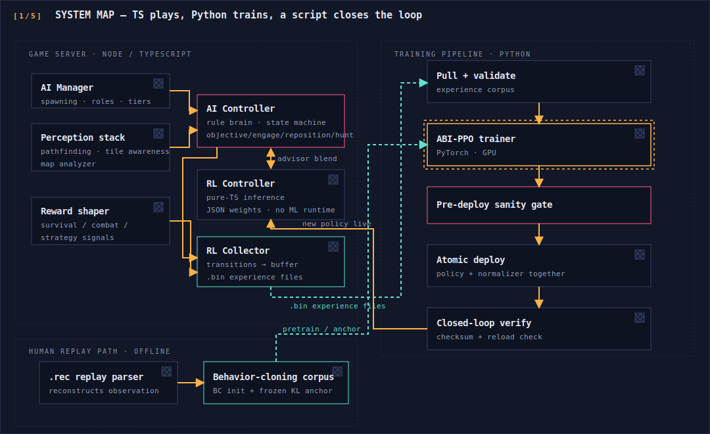
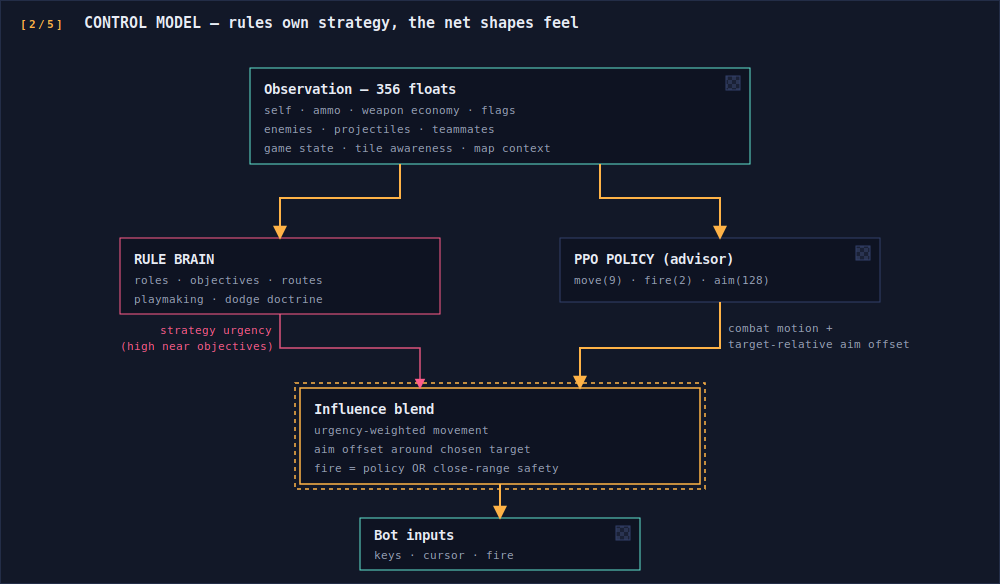
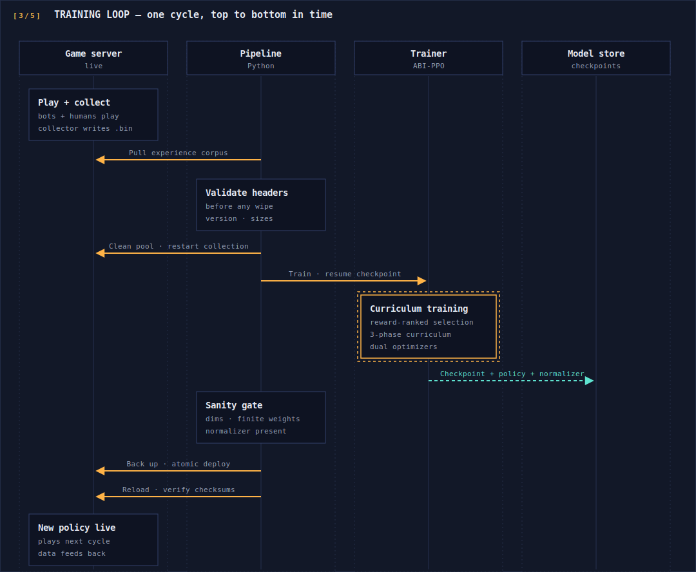
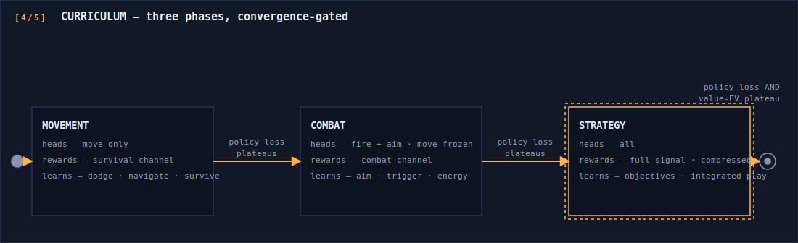
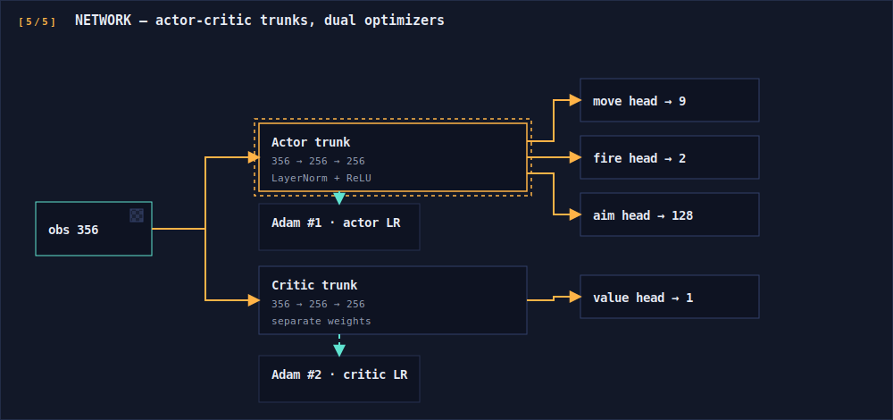

# ABI-PPO — System Architecture

High-level architecture of the ARCbound Intelligence stack. Everything below is
a conceptual description of the private implementation; the novel algorithms
are characterized by what they do, not how they are coded.

---

## 1. Component layout

Three languages, three jobs: TypeScript plays the game, Python trains, and a
pipeline script closes the loop between them.

Key property: the inference engine is dependency-free TypeScript. The trainer
exports weights as JSON; the server loads them, runs the forward pass at game
tick rate, and a dimension guard rejects any policy whose input width doesn't
match the runtime's observation contract (bots fall back to pure rules).

---

## 2. The two-layer control model

The bots are a rule-based state machine with the PPO policy blended in as an
advisor — the net shapes combat *feel*, the rules own *strategy*.

- **Movement** is a weighted mix: the more urgent the rule layer's objective,
  the less the net's movement counts; in open combat the net dominates.
- **Aim** is *relative*: the rules pick the target, the net predicts a bounded
  angular correction around it (128 bins across ±90°). The net can make aim
  feel human; it cannot aim at the wrong thing.
- **Fire** is binary from the net, with a rule-side safety override at close
  range. Weapon *selection* stays rule-based and ballistics-aware (line-of-sight
  for hitscan, bank-shot solving for bouncing projectiles, arc validation for
  lobbed ones).
- A single influence dial (also scaled by difficulty tier) moves each bot along
  the pure-rules ↔ trust-the-net axis.

---

## 3. Training loop data flow

The full production cycle, end to end:

Design intents worth noting:

- **The environment is the live game.** There is no simulator; every training
  batch is real multiplayer play, so corpus hygiene (validation before wipes,
  pull-loss abort thresholds, two cleans per cycle so each batch reflects only
  the current policy) is a first-class concern.
- **A broken policy cannot ship.** The pre-deploy gate mirrors the runtime's
  own dimension guard; policy and normalizer deploy atomically as a pair; the
  go-live check is closed-loop (on-disk checksums compared to the training
  output, not a log grep). One command rolls back to any snapshot.

---

## 4. Curriculum stages

Three phases, each mastering one skill before the next unlocks. Transitions
are convergence-driven, not scheduled.

Each phase carries its own reward filter, head mask, learning rates, entropy
pressure, and convergence detector. Two subtleties:

- **Terminal-reward compression is monotonic.** Large terminal rewards are
  compressed to tame advantage explosions, but strictly order-preservingly —
  win > capture > grab > kill must survive compression. (An earlier
  non-monotonic clip inverted that ordering and taught bots that grabbing beat
  winning; the fix is one of the project's hard-won lessons.)
- **The critic-priority phase gates on explained variance**, not just policy
  loss, so the slow long-horizon value head can't be cut off by the fast
  policy head converging first.

---

## 5. Network and observation contract

The observation is a versioned contract shared byte-for-byte between the
TypeScript encoder and the Python trainer: self-state, ammo and weapon
economy, objective/flag context, nearby enemies and projectiles and teammates,
game state, a local tile-awareness slice (viewport wall grid + raycasts), and
the static per-map context digest appended in v7. Version bumps append — they
never reorder — and both ends enforce the width, so mismatched artifacts are
rejected rather than silently misread. Experience files carry a self-describing
header (count, observation size, action size, version) for the same reason.

---

## 6. Runtime AI beyond the net

The rule brain is a substantial system in its own right (~21 K lines of
TypeScript): role assignment with hysteresis so near-equidistant bots don't
thrash, carrier interception that paths *ahead* of a flag carrier, per-mode
objective doctrines (CTF, neutral-flag, switch-control, assassin, FFA),
capture-cost-ranked target selection, curated per-map attack lanes with
degradation-safe waypoint filters, per-opponent shot-angle dodge tracking, and
combat-aware stuck recovery. A utility-scoring decision substrate runs in
shadow as the eventual replacement for per-role scripts. All of it is covered
by unit tests that run the real map grids in CI.
